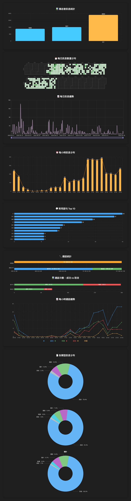

# LINE 聊天記錄分析

這是一個專為 LINE 聊天記錄所打造的互動式視覺分析平台，使用者只需上傳 `.txt` 格式的聊天檔案，即可自動生成一系列統計圖表，包含訊息數量趨勢、通話記錄、熱門語句與訊息類型分布等，並支援一鍵匯出為報告圖片。

## 使用方式

1. 開啟網站並進入首頁
2. 將 LINE 匯出的聊天記錄 `.txt` 檔案拖曳或點擊上傳
3. 等待數秒進行分析與載入圖表
4. 若想保存結果，電腦版可點選「一鍵下載分析」匯出整體分析報告圖片

## 分析圖表說明

- **傳送者訊息統計**：依發送者統計訊息數量（長條圖）
- **每日訊息分布與趨勢**：日曆視覺化每一天的發言量，搭配曲線趨勢圖（日曆熱力圖、折線圖）
- **每小時訊息分布**：顯示一天 24 小時內訊息活躍度（曲線疊圖）
- **常用語句 Top 10**：分析聊天室中出現頻率最高的詞彙（長條圖）
- **通話統計與趨勢**：包含通話總時長、成功 vs 取消次數、每小時通話趨勢（長條圖、折線圖）
- **各類型訊息分布**：呈現各種訊息型態圖片、貼圖、影片等分布（圓餅圖）

    <h3>聊天記錄分析 Demo</h3>
        

## 資安聲明

> - 所有操作皆在你的瀏覽器中執行
> - 不會上傳任何檔案至伺服器
> - 完全不留資料紀錄，請安心使用
